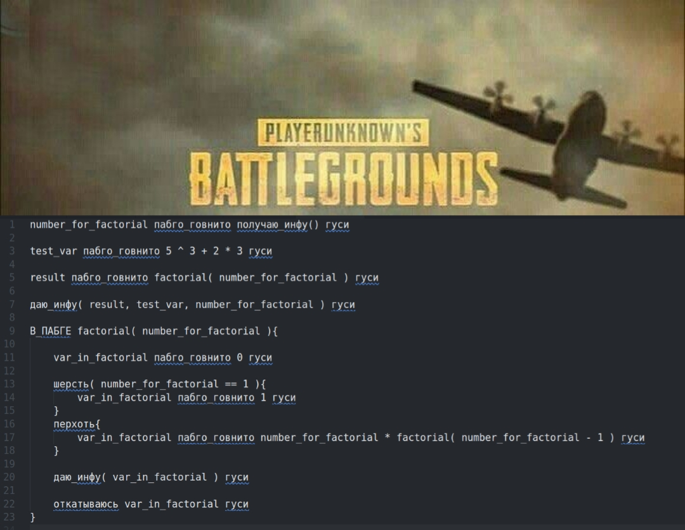

# ШЛЯПНЫЙ ПАБГ - Это Язык Программирования Для Людей, Кто Ненавидит PUBG, Но Играет В Него....

Язык был написан по мотивам уже известных: ```Python``` и ```C Programming Language```, с целью предоставить любителям королевской битвы не только
возможность стать лучшими, но ещё и сделать это на лучшем языке программирования :)



# Установка программы 👾

### **Чтобы скачать весь проект, нужно:**

1. В Вашем терминале необходимо указать директорию, куда вы хотите скачать данный проект.

2. Затем в терминале введите.
```
git clone git@github.com:SergioFoma/Compiler.git
```

3. Дождитесь скачивания.

4. После чего будет создана рабочая директория с названием репозитория.

# Запуск программы 🚀

Чтобы запустить программу на языке ШЛЯПНЫЙ ПАБГ, необходимо:

1. Открыть текстовый документ ```code.txt``` в папке ```Compiler/frontend```.

2. Написать в данном файле свой код на языке ```шляпный пабг```

>⚠️ Проект использует фиксированную структуру каталогов для обеспечения работы конвейера сборки.
> Скрипт compile.sh жестко связывает этапы (Frontend, Middleend, Backend), гарантируя передачу промежуточных артефактов (AST, ассемблерный код) между модулями.
> При необходимости пути легко переопределяются через переменные внутри скрипта.

3. Прописать в консоли команду.
```
commonFiles/compile.sh
```

Данная команда запустит компиляцию всех файлов проекта и начнёт его исполнение.


4. Результатом выполнения программы является байт-код, готовый к исполнению.

# Архитектура компилятора ⚙️
Компилятор написан на C/C++ и состоит из трёх частей:

1. Frontend: Лексический и синтаксический анализ. Переводит исходный код(```code.txt```) в абстрактное синтаксическое дерево (AST). Структуры узлов AST реализованы с помощью union, что позволяет хранить разные типы данных(числа, переменные, операторы).

2. Midleend: Здесь происходит оптимизация AST - свертка констант(умножени на 0, сложение двух чисел, умножение на 1 и тд...)

3. Backend: Генерация ассмблерного кода. Обходит AST и генерирует ассемблерный код(код генерируется для ранее написанного мной процессора SPU)

4. ASM: Генерация байт кода. Осуществляется перевод ассемблерыных команд в байт-код.

# Возможности языка 💻

1. **Statements**

|   Statement в языке ШЛЯПНЫЙ ПАБГ  |   Statement в С   |
|:---------------------------------:|:-----------------:|
|           gusi                    |      ;            |
|           wool                    |      if           |
|           beka                    |      while        |
|           dandruff                |       else        |
|           rolling_back            |      return       |
|           pabgo_govnito           |       =           |

2. **Поддержка переменных, и возможность их инициализации**
```c
new_var gusi

var_that_will_initialization pabgo_govnito 10 gusi
```

>⚠️ Если переменная не будет проинициализирована, то может
>возникнуть неопределенное поведение!

3. **Доступные математические функции**

| Имя математической функции  | Вид математической функции в языке программирования |
| :--------------------------:| :--------------------------------------------------:|
|        Сумма                |                     +                               |
|        Разность             |                     -                               |
|        Умножение            |                     *                               |
|        Деление              |                     /                               |
|    Возведение в степень     |                     ^                               |

4. **Встроенные функции**

| Встроенная функция          | Аналог встроенной функции в Python     | Аналог встроенной функции в C |
|:---------------------------:|:--------------------------------------:|:-----------------------------:|
| give_info                   |       print                            |      printf                   |
| get_info                    |       input                            |      scanf                    |

### Примеры использования
```c
get_info( 5 ) gusi
get_info( pubgVariable ) gusi
get_info( factorial( n ) ) gusi

get_info( first_var, 69, second_var ) gusi
```

```c
first_var
69
second_var
```

```
get_info() gusi

var_from_keyboard pabgo_govnito get_info() gusi
```

5. **Операторы сравнения**

| Название оператора сравнения      |       Обозначение         |
|:---------------------------------:|:-------------------------:|
|       строго больше               |          >                |
|       больше или равно            |          >=               |
|       строго меньше               |          <                |
|       меньше или равно            |          <=               |
|       эквивалентность             |          ==               |
|       неравенство                 |          !=               |

6. **В языке ШЛЯПНЫЙ ПАБГ поддерживается объявление функций и, соответственно, рекурсивный вызов функций.**

>⚠️ Определение функции начинается с ключевого слова  IN_PUBG </div>

```Пример определения функции```

```c
IN_PUBG factorial( number_for_factorial ){

    var_in_factorial pabgo_govnito 0 gusi

    wool( number_for_factorial == 1 ){
        var_in_factorial pabgo_govnito 1 gusi
    }
    dandruff{
        var_in_factorial pabgo_govnito number_for_factorial * factorial( number_for_factorial - 1 ) gusi
    }

    give_info( var_in_factorial ) gusi

    rolling_back var_in_factorial gusi
}
```

```Пример вызова функции```

```c

number_for_factorial pabgo_govnito get_info() gusi

result pabgo_govnito factorial( number_for_factorial ) gusi

```

7. **Комментарии**

В языке предусмотрена поддержка комментариев, так что программист может оставлять свои светлые мысли прямо внутри кода, не мешая работе самой программы

```c

##! Это комментарий :)  !##

```

# Заключение

Язык ШЛЯПНЫЙ ПАБГ - отличная возможность не только насладиться игрой PUBG, но и внести в нее какие - то улучшения, при должном желании
можно даже заново написать игру, только уже улучшенную версию. А самое главное в языке то, что программа на нем может компилироваться
вне зависимости от того, взяли Вы топ 1 или нет.

```
 ________________________________________
|       PUBG-ПРОГРАММИРОВАНИЕ:           |
|   когда код должен выжить любой ценой  |
|________________________________________|

```
